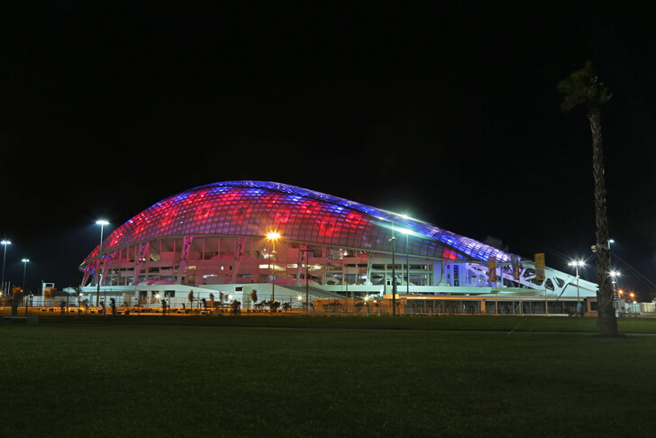
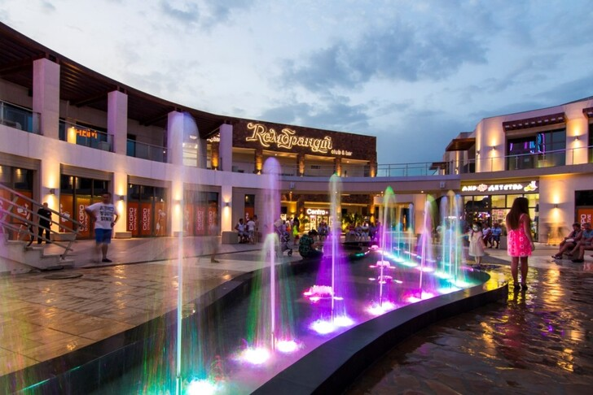
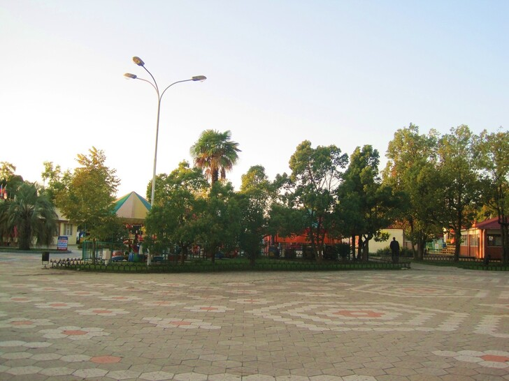

# Where to go tonight in Adler

Choosing Adler for your vacation is always a great idea. One of the southernmost resort cities in Russia boasts many advantages. There is a bright subtropical nature, excellent beaches, awarded with the "Blue Flag", and a kaleidoscope of entertainment - both during the day and at night.

And, unlike many cities, Adler is almost awake - snack, dance, socializing, walking here can be found almost around the clock. Where to go in the evening in the first place, read our guide.

Where to go in the Adler in the evening: the central parks and the waterfront.
Thinking about where to go for a walk in the Adler in the evening? The most correct answer to this question is the quay. The epicenter of tourist life in any city by the sea, Adler Quay has turned from an unremarkable promenade into a cozy modern recreation space over the past 10 years. Reconstruction was timed to coincide with a historic event - the Olympic Games in 2014.

Thanks to this we have 1.5 kilometers of beautiful walking area, from the bank of the river Mzymta to the territory of the sanatorium "South Sea". There are modern shopping centers, and beach clubs with swimming pools, installations, sculptures, recreation areas, restaurants and cafes. Paddle the eye with exotic plants, spectacular panoramas of the Caucasus Mountains, Adler lighthouse, and of course the sea waves crashing on the pebble shore.

Evening is probably the best time for a leisurely stroll along the seafront. At this time, street cafe tables light candles, luring visitors with musical melodies and the opportunity to spend the sunset by the sea. A small tip: choose a cafe with a panoramic terrace and open sea view, for example, restaurants VinoGrad or "Fregat".

Bestuzhev-Marlinsky Square, with a monument to the writer and Decembrist, an ancient cannon, as well as a playground are located near the seafront - it is convenient to come here in the evening with young travelers.

The most popular walking space on the seafront is located near Mandarin Shopping Mall. Here in the evenings there are often held music concerts, entertainment events and city celebrations, from here you can go sailing on yachts and boats. There is no shortage of gastronomic facilities on the seafront: here you will find various cuisines and food concepts, from snack stalls to glamorous restaurants. Dinner is available for any taste and budget.

Adler Park of Culture and Leisure has become an equally popular evening destination for walks. About 2 hectares of walking alleys, sports and children playgrounds, attractions, recreation areas, an artificial reservoir in the center - everything is very clean and well-groomed. Several years ago the park was reconstructed, and now it is a pleasant modern space for rest of the whole family.

What to do in the park in the evening? Both children and adults can go for a ride on attractions or drive on an autodrome. You can see the evening Adler from the Ferris wheel, or dance at a disco in the open air. Of course, we haven't forgotten about gourmets in the park, and here you can have a snack of street food, and have a full dinner. In the warm season, the park's alleys are waiting for guests until 22:00.
